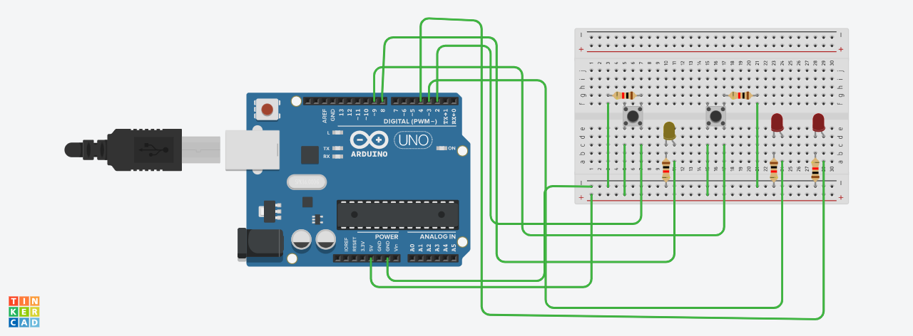
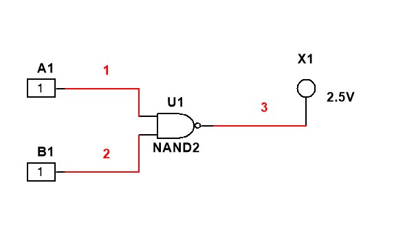

# Basic Logic Gates Using Arduino

*Designed by Papa Kofi Boahen.*

 

Logic Gates are the basic building blocks of any digital system. Logic Gate integrated circuits are used to implement Boolean functions or expressions. However, with an Arduino, you could simulate the working of logic
gates. This repo shows how this can be done. In the repository:

- Truth_table - Contains the truth tables for the basic logic gates
- Circuit_diagram - Find an image of the circuit diagram
- NAND_gate - Find an image of a NAND GATE simulated with multisim
- Components - Find the various components used and their quantities

The circuit may be simulated with TinkerCad. Use this link to access it

https://www.tinkercad.com/things/gbyGYyZrvoM-basicgates/editel

Logic Gates may be simulated with MultiSim by National Instruments as well.

**An image of a simulation of NAND GATE with MultiSim**
 

**See logic gates in action** Follow this link to see the videos:
https://photos.google.com/album/AF1QipO8kMxc9jJpLsQQPbcz_IU9iWmHPR9cu3figFdf

Happy learning.

